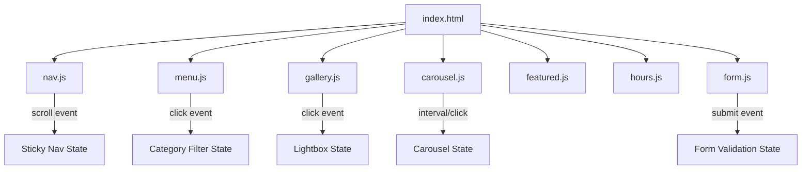

# Design Document: Cafe Website

## Overview

A single-page, mobile-first cafe website built with semantic HTML5, Tailwind CSS (via CDN or build step), and vanilla JavaScript. The site targets students, workers, young adults, and coffee enthusiasts with a cozy-industrial-modern aesthetic expressed through a blue-toned palette. All nine content sections are anchored on one scrollable page with smooth-scroll navigation.

### Goals
- Communicate brand identity immediately on load
- Drive conversions via reservation form and menu exploration
- Achieve Lighthouse Performance ≥ 80 on mobile
- Be fully accessible (keyboard navigation, focus indicators, reduced-motion support)

### Technology Stack

| Layer | Choice | Rationale |
|---|---|---|
| Markup | HTML5 (semantic) | Native semantics, no framework overhead |
| Styling | Tailwind CSS v3 | Utility-first, purge-unused CSS, responsive breakpoints built-in |
| Scripting | Vanilla JS (ES2020+) | Zero dependencies, small bundle, sufficient for interactions |
| Fonts | Google Fonts | Free, CDN-hosted, subset loading |
| Maps | Google Maps Embed API (iframe) | Simple, no JS SDK required |
| Build (optional) | Vite + PostCSS | Fast HMR, Tailwind JIT, tree-shaking |

No frontend framework (React/Vue) is required — the site is content-driven with light interactivity.

---

## Architecture

### File Structure

```
cafe-website/
├── index.html              # Single HTML file, all sections
├── src/
│   ├── css/
│   │   └── main.css        # Tailwind directives + custom CSS vars
│   ├── js/
│   │   ├── main.js         # Entry point, initialises all modules
│   │   ├── nav.js          # Sticky nav, hamburger, smooth scroll
│   │   ├── menu.js         # Category tab filtering
│   │   ├── gallery.js      # Lightbox, lazy-load
│   │   ├── carousel.js     # Testimonials auto-advance carousel
│   │   ├── featured.js     # Featured products carousel (mobile)
│   │   ├── hours.js        # Highlight today's opening hours
│   │   └── form.js         # Reservation form validation
│   └── data/
│       ├── menu.json       # Menu items data
│       ├── testimonials.json
│       └── gallery.json
├── public/
│   └── images/             # Optimised WebP images
├── tailwind.config.js
├── vite.config.js
└── package.json
```

### Rendering Strategy

All content is server-rendered (static HTML). JavaScript progressively enhances:
- Navigation sticky behaviour
- Menu tab filtering (show/hide CSS classes)
- Gallery lightbox
- Carousel auto-advance
- Form validation

This ensures the page is functional without JS and achieves fast First Contentful Paint.

### Component Interaction Diagram



---

## Components and Interfaces

### Global Design System

#### Color Tokens (CSS Custom Properties)

```css
:root {
  --color-primary-dark:  #0A2E5E;  /* Deep navy — backgrounds, footer, nav */
  --color-primary:       #1565C0;  /* Mid blue — buttons, accents */
  --color-accent:        #42A5F5;  /* Sky blue — hover states, highlights */
  --color-white:         #FFFFFF;  /* Text on dark, card backgrounds */
  --color-overlay:       rgba(10, 46, 94, 0.60); /* Hero overlay */
  --color-featured-overlay: rgba(21, 101, 192, 0.20); /* Featured card hover */
}
```

#### Tailwind Config Extension

```js
// tailwind.config.js
module.exports = {
  theme: {
    extend: {
      colors: {
        'primary-dark': '#0A2E5E',
        'primary':      '#1565C0',
        'accent':       '#42A5F5',
      },
      fontFamily: {
        display: ['Playfair Display', 'Georgia', 'serif'],
        body:    ['Inter', 'system-ui', 'sans-serif'],
      },
    },
  },
}
```

#### Typography Scale

| Level | Font | Size (desktop) | Size (mobile) | Weight | Usage |
|---|---|---|---|---|---|
| Display | Playfair Display | 64px / 4rem | 36px / 2.25rem | 700 | Hero headline |
| Heading 1 | Playfair Display | 48px / 3rem | 32px / 2rem | 700 | Section titles |
| Heading 2 | Inter | 28px / 1.75rem | 22px / 1.375rem | 600 | Card titles, sub-sections |
| Body | Inter | 16px / 1rem | 16px / 1rem | 400 | Paragraphs, descriptions |
| Caption | Inter | 13px / 0.8125rem | 13px / 0.8125rem | 400 | Labels, badges, meta |

Line-height: 1.6 for body text, 1.2 for headings.

#### Responsive Breakpoints (Tailwind defaults)

| Name | Min Width | Target |
|---|---|---|
| `sm` | 640px | Large phones |
| `md` | 768px | Tablets |
| `lg` | 1024px | Small desktops |
| `xl` | 1280px | Standard desktops |

Mobile-first: base styles target 320px+, breakpoints add overrides upward.

#### Spacing Scale

Uses Tailwind's default 4px base unit. Key values: `p-4` (16px), `p-8` (32px), `p-16` (64px), `gap-6` (24px).

#### Animation Tokens

```css
/* Respect prefers-reduced-motion */
@media (prefers-reduced-motion: reduce) {
  *, *::before, *::after {
    animation-duration: 0.01ms !important;
    transition-duration: 0.01ms !important;
  }
}
```

Standard durations: 200ms (hover micro), 300ms (CTA hover), 600ms (scroll), 5000ms (carousel interval).

---

### Section 1: Hero

**Layout:** Full-viewport (`min-h-screen`), stacked flex column, centered content.

**Structure:**
```
<section id="hero">
  <div class="hero-bg">          <!-- background image + overlay -->
  <div class="hero-content">
    <h1>Primary Headline</h1>
    <p>Supporting subheadline</p>
    <a href="#menu" class="btn-primary">Explore Menu</a>
    <a href="#contact" class="btn-outline">Reserve a Table</a>
  </div>
</section>
```

**Visual Specs:**
- Background: `background-image` with `object-fit: cover`, overlaid with `::after` pseudo-element using `background: var(--color-overlay)` (60% opacity)
- Headline: Display font, ≥48px desktop / ≥32px mobile, white
- CTA buttons: `btn-primary` = `bg-primary text-white px-8 py-3 rounded-full transition-colors duration-300 hover:bg-accent`
- Outline variant: `border-2 border-white text-white hover:bg-white hover:text-primary-dark`

---

### Section 2: Navigation

**Layout:** `<header>` with `<nav>`, horizontal flex on desktop, hamburger on mobile.

**States:**
- Default (at top): transparent background, white text
- Sticky (scrolled past hero): `bg-primary-dark` background, white text, `shadow-lg`
- Mobile open: full-width dropdown below nav bar

**Behaviour (nav.js):**
```js
// Sticky trigger
window.addEventListener('scroll', () => {
  const heroHeight = document.getElementById('hero').offsetHeight;
  nav.classList.toggle('is-sticky', window.scrollY > heroHeight);
});

// Smooth scroll
navLinks.forEach(link => {
  link.addEventListener('click', e => {
    e.preventDefault();
    const target = document.querySelector(link.getAttribute('href'));
    target.scrollIntoView({ behavior: 'smooth' });
  });
});
```

**Mobile hamburger:** Three-line SVG icon, toggles `aria-expanded`, reveals `<ul>` with `max-h` transition.

**Tap targets:** All `<a>` and `<button>` elements in nav have `min-h-[44px] min-w-[44px]`.

---

### Section 3: About

**Layout:** Two-column grid on desktop (`grid-cols-2`), single column on mobile.

**Structure:**
```
<section id="about">
  <div class="grid md:grid-cols-2 gap-12 items-center">
    <div class="about-text">
      <h2>Our Story</h2>
      <p>80–150 word body text</p>
      <div class="brand-values grid grid-cols-3 gap-4">
        <!-- 3× icon + label pairs -->
      </div>
    </div>
    <div class="about-image">
      
    </div>
  </div>
</section>
```

**Brand value icons:** SVG icons (inline or via icon font), each with a short label. Examples: "Freshly Roasted", "Locally Sourced", "Community First".

---

### Section 4: Menu

**Layout:** Tab bar + responsive grid.

**Structure:**
```
<section id="menu">
  <div class="menu-tabs" role="tablist">
    <button role="tab" aria-selected="true" data-category="coffee">Coffee</button>
    <button role="tab" data-category="non-coffee">Non-Coffee</button>
    <button role="tab" data-category="food">Food</button>
  </div>
  <div class="menu-grid grid grid-cols-1 md:grid-cols-2 lg:grid-cols-3 gap-6">
    <!-- MenuItem cards, filtered by JS -->
  </div>
</section>
```

**MenuItem Card:**
```
<article class="menu-card" data-category="coffee">
  
  <div class="card-body">
    <h3>Item Name</h3>
    <p class="description">Short description ≤15 words</p>
    <span class="price">Rp 35.000</span>
    <!-- if unavailable: -->
    <span class="badge-sold-out">Sold Out</span>
  </div>
</article>
```

**Hover effect (CSS):**
```css
.menu-card {
  transition: transform 200ms ease, box-shadow 200ms ease;
}
.menu-card:hover {
  transform: scale(1.03);
  box-shadow: 0 8px 24px rgba(0,0,0,0.15);
}
```

**Tab filtering (menu.js):**
```js
tabs.forEach(tab => {
  tab.addEventListener('click', () => {
    const cat = tab.dataset.category;
    cards.forEach(card => {
      card.hidden = (cat !== 'all' && card.dataset.category !== cat);
    });
    // update aria-selected
  });
});
```

---

### Section 5: Featured Products

**Layout:** Horizontal scroll carousel on mobile (`overflow-x-auto snap-x`), 3-column grid on desktop.

**Card hover overlay:**
```css
.featured-card .overlay {
  background: rgba(21, 101, 192, 0.20);
  opacity: 0;
  transition: opacity 250ms ease;
}
.featured-card:hover .overlay { opacity: 1; }
.featured-card:hover .cta-btn { display: flex; }
```

**Badge:** `<span class="badge">Best Seller</span>` — `bg-accent text-white text-xs px-2 py-1 rounded-full`.

---

### Section 6: Gallery

**Layout:** CSS columns masonry (3-col desktop, 2-col tablet, 1-col mobile) with `column-count`.

**Lightbox (gallery.js):**
- On image click: create/show `<dialog>` element with ``, prev/next buttons
- Keyboard: `Escape` closes, `ArrowLeft`/`ArrowRight` navigates
- Focus trap inside dialog while open

**Lazy loading:** All gallery `` use `loading="lazy"` attribute. For browsers without native support, an `IntersectionObserver` fallback swaps `data-src` → `src`.

---

### Section 7: Testimonials

**Layout:** Single-card carousel with dot navigation and arrow buttons.

**Auto-advance (carousel.js):**
```js
let interval = setInterval(advance, 5000);

dotsAndArrows.forEach(el => {
  el.addEventListener('click', () => {
    clearInterval(interval); // pause on interaction
    navigate(el.dataset.index);
  });
});
```

**Reviewer avatar:** `<div class="avatar w-12 h-12 rounded-full bg-primary flex items-center justify-center text-white font-bold">JD</div>` — initials fallback if no image.

**Star rating:** Five `<svg>` star icons, filled/unfilled based on numeric rating value.

---

### Section 8: Location & Hours

**Layout:** Two-column on desktop (`grid-cols-2`), stacked on mobile.

**Map:** `<iframe>` Google Maps embed, `width="100%" height="400"`, `loading="lazy"`.

**Hours table:** `<table>` with `<tr>` per day. Today's row highlighted via `hours.js`:
```js
const today = new Date().toLocaleDateString('en-US', { weekday: 'long' });
document.querySelectorAll('.hours-row').forEach(row => {
  if (row.dataset.day === today) row.classList.add('bg-accent/20', 'font-semibold');
});
```

**Get Directions CTA:** `<a href="https://maps.google.com/?q=ADDRESS">Get Directions</a>` — opens native maps app on mobile.

---

### Section 9: Contact / Reservation

**Layout:** Centered single-column form, max-width 640px.

**Form fields:** name, email, phone, date, time, guests (number), message (optional textarea).

**Validation (form.js):**
- Required fields: all except message
- Email: `/^[^\s@]+@[^\s@]+\.[^\s@]+$/`
- Phone: `/^\d{8,15}$/`
- On invalid submit: add `.field-error` class, insert `<p role="alert">` error message adjacent to field
- On success: replace form with `<div class="success-message">` within 1 second

**Clickable contact links:**
```html
<a href="mailto:hello@cafe.com">hello@cafe.com</a>
<a href="tel:+62812345678">+62 812-345-678</a>
```

---

### Section 10: Footer

**Layout:** Three-column on desktop (`grid-cols-3`), single-column on mobile.

**Columns:**
1. Logo + tagline + copyright
2. Section navigation links
3. Social media icons (Instagram, Facebook, TikTok)

**Social icon hover:** `transition-colors duration-200 hover:text-accent`

**Background:** `bg-primary-dark text-white`

---

## Data Models

### MenuItem

```typescript
interface MenuItem {
  id: string;           // "coffee-001"
  category: 'coffee' | 'non-coffee' | 'food';
  name: string;         // "Signature Latte"
  description: string;  // ≤15 words
  price: number;        // in IDR, e.g. 35000
  image: string;        // path to WebP image
  available: boolean;   // false = show "Sold Out"
  featured: boolean;    // true = show in Featured Products
  badge?: string;       // "Best Seller" | "Staff Pick" | undefined
}
```

### Testimonial

```typescript
interface Testimonial {
  id: string;
  reviewerName: string;
  avatar?: string;      // image path; if absent, use initials
  rating: 1 | 2 | 3 | 4 | 5;
  text: string;         // ≤60 words
}
```

### GalleryImage

```typescript
interface GalleryImage {
  id: string;
  src: string;          // WebP path
  alt: string;          // descriptive alt text
  width: number;
  height: number;
}
```

### OpeningHours

```typescript
interface OpeningHours {
  day: 'Monday' | 'Tuesday' | 'Wednesday' | 'Thursday' | 'Friday' | 'Saturday' | 'Sunday';
  open: string;         // "08:00"
  close: string;        // "22:00"
  closed: boolean;      // true = display "Closed"
}
```

### ReservationFormData

```typescript
interface ReservationFormData {
  fullName: string;
  email: string;        // validated: local@domain.tld
  phone: string;        // validated: 8–15 digits
  preferredDate: string; // ISO date string
  preferredTime: string; // "HH:MM"
  guests: number;       // ≥1
  message?: string;
}
```

---


## Correctness Properties

*A property is a characteristic or behavior that should hold true across all valid executions of a system — essentially, a formal statement about what the system should do. Properties serve as the bridge between human-readable specifications and machine-verifiable correctness guarantees.*

### Property 1: Content Word Count Constraints

*For any* content string rendered in the site (hero headline, hero subheadline, footer tagline, menu item description, testimonial review text, about section body), the word count must satisfy the constraint defined for that content type: headline ≤10 words, subheadline ≤20 words, tagline ≤10 words, menu description ≤15 words, review text ≤60 words, about body 80–150 words.

**Validates: Requirements 1.2, 1.3, 4.2, 7.1, 10.1**

---

### Property 2: Category Filter Correctness

*For any* category tab selection and any menu items dataset, after the filter is applied, every visible menu card's `data-category` attribute must equal the selected category (or all cards are visible when "all" is selected).

**Validates: Requirements 4.3**

---

### Property 3: Unavailable Items Show Sold-Out Badge

*For any* menu item where `available = false`, the rendered card must contain a sold-out badge element and any associated CTA must be disabled or absent.

**Validates: Requirements 4.6**

---

### Property 4: Featured Items Count and Rendering Completeness

*For any* featured items selection, the count must be between 3 and 6 inclusive, and for each featured item, the rendered card must contain an image element, a name element, a description element, a price element, and a badge element with non-empty text.

**Validates: Requirements 5.1, 5.2, 5.3**

---

### Property 5: Gallery Images Count and Lazy Loading

*For any* gallery images dataset, the count must be ≥6, and for every gallery `` element rendered, the `loading` attribute must equal `"lazy"`.

**Validates: Requirements 6.1, 6.5**

---

### Property 6: Lightbox Opens on Image Click

*For any* gallery image element, clicking it must cause the lightbox dialog to become visible and display an `` whose `src` matches the clicked image's source.

**Validates: Requirements 6.3**

---

### Property 7: Testimonials Count and Star Rating Rendering

*For any* testimonials dataset, the count must be ≥4, and for any testimonial with rating value `n` (where 1 ≤ n ≤ 5), the rendered star component must contain exactly `n` filled star icons and exactly `5 - n` unfilled star icons.

**Validates: Requirements 7.1, 7.2**

---

### Property 8: Opening Hours Completeness and Today Highlight

*For any* opening hours dataset, it must contain an entry for each of the 7 days of the week. For any day value passed to the hours highlighter function, the table row whose `data-day` attribute matches that day must receive the highlight CSS class, and no other row must receive it.

**Validates: Requirements 8.3, 8.4**

---

### Property 9: Form Field Validation (Email and Phone)

*For any* string that matches the pattern `local@domain.tld` (non-whitespace characters, `@`, non-whitespace characters, `.`, non-whitespace characters), the email validator must return `true`; for any string that does not match, it must return `false`. *For any* numeric string of length 8–15 digits, the phone validator must return `true`; for any string containing non-digit characters or with length outside 8–15, it must return `false`.

**Validates: Requirements 9.4, 9.5**

---

### Property 10: Form Validation Error Display

*For any* form submission attempt where one or more required fields are empty or invalid, each invalid field must have an adjacent error message element with `role="alert"`, and the values of all other (valid) fields must remain unchanged.

**Validates: Requirements 9.3**

---

### Property 11: Interactive Element Focus Indicators

*For any* interactive element on the page (buttons, anchor links, form inputs, selects, textareas), the element must have a non-default `:focus-visible` CSS style that provides a visible outline or ring indicator.

**Validates: Requirements 11.7**

---

### Property 12: Navigation Tap Target Size

*For any* interactive element within the navigation component (links, hamburger button), its computed width and height must both be ≥44px on mobile viewports.

**Validates: Requirements 2.6**

---

## Error Handling

### Form Validation Errors
- Inline error messages appear adjacent to each invalid field using `role="alert"` for screen reader announcement
- Errors are cleared when the user corrects the field value
- Form submission is prevented until all required fields are valid
- No field values are cleared on failed submission

### Image Load Failures
- All `` elements include a descriptive `alt` attribute
- CSS `background-color` fallback is set on image containers so layout is preserved if images fail to load
- Gallery lightbox handles missing images gracefully by showing the alt text

### Map Embed Failures
- The Google Maps `<iframe>` is wrapped in a container with a fallback text showing the address
- If the iframe fails to load, the address and "Get Directions" link remain functional

### JavaScript Errors
- All JS modules use `try/catch` around DOM queries and event handlers
- If a module fails to initialise, the rest of the page remains functional (progressive enhancement)
- The menu tab filter degrades gracefully — all items remain visible if JS fails

### Carousel Edge Cases
- Testimonials carousel wraps around (last → first, first → last) on arrow navigation
- Featured products carousel on mobile handles fewer than 3 items without breaking layout

---

## Testing Strategy

### Dual Testing Approach

Unit tests cover specific examples, edge cases, and error conditions. Property-based tests verify universal properties across all inputs. Both are complementary.

### Property-Based Testing Library

**Recommended:** [fast-check](https://fast-check.dev/) (JavaScript/TypeScript)

- Runs 100+ iterations per property by default
- Supports arbitrary generators for strings, numbers, arrays, objects
- Integrates with Vitest and Jest

### Property Test Configuration

Each property test must:
- Run a minimum of 100 iterations (`numRuns: 100` in fast-check)
- Include a comment tag referencing the design property
- Tag format: `// Feature: cafe-website, Property N: <property_text>`

Example:
```js
// Feature: cafe-website, Property 9: Form Field Validation (Email and Phone)
it('email validator accepts valid emails and rejects invalid ones', () => {
  fc.assert(
    fc.property(
      fc.emailAddress(), // fast-check built-in email generator
      (email) => {
        expect(validateEmail(email)).toBe(true);
      }
    ),
    { numRuns: 100 }
  );
});
```

### Unit Tests

Focus on:
- Specific DOM structure assertions (nav links count, form fields present, footer columns)
- Breakpoint layout checks (CSS class presence at specific viewport widths)
- Carousel timer behaviour (mock `setInterval`/`clearInterval`)
- Lightbox open/close on click and Escape key
- Today's hours row highlight with a fixed date mock
- Success message display on valid form submission

### Integration Tests

- Lighthouse CI: run against built site, assert Performance ≥80 on mobile
- Cross-browser smoke tests at 320px, 768px, 1280px viewports

### Test Runner

**Recommended:** [Vitest](https://vitest.dev/) with [jsdom](https://github.com/jsdom/jsdom) environment for DOM testing.

```json
// vitest.config.js
{
  "test": {
    "environment": "jsdom",
    "globals": true
  }
}
```

### Coverage Targets

| Area | Strategy | Target |
|---|---|---|
| Validation functions | Property-based (fast-check) | 100% branch coverage |
| DOM interactions | Unit tests (jsdom) | All user-facing interactions |
| Responsive layout | Example tests at 3 breakpoints | 320px, 768px, 1280px |
| Performance | Lighthouse CI | Score ≥80 mobile |
| Accessibility | axe-core integration | 0 critical violations |
